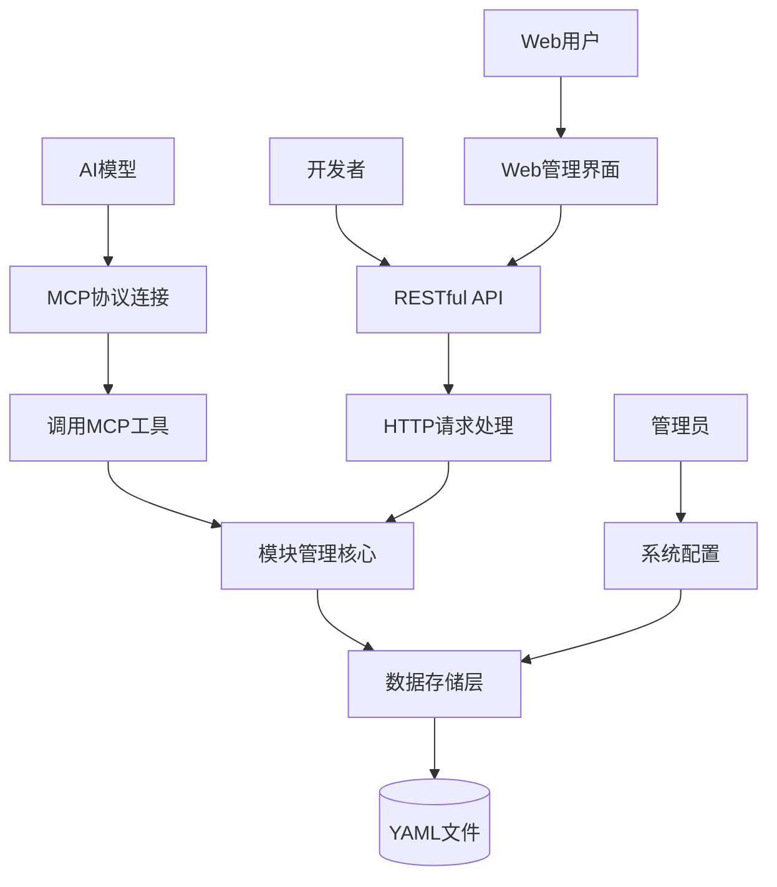

# 代码文档管理工具 - 产品需求文档

## 1. 产品概述

本产品是一个基于MCP协议的代码文档管理工具，旨在为AI模型和开发者提供标准化的代码结构信息管理服务。通过层次化命名系统和多种接口支持，实现代码模块的高效存储、查询和管理，帮助AI模型更好地理解和操作代码结构。

产品面向AI开发者和需要代码文档管理的团队，解决代码结构信息分散、查询困难、标准化程度低的问题，提升开发效率和代码可维护性。

## 2. 核心功能

### 2.1 用户角色

| 角色 | 使用方式 | 核心权限 |
|------|----------|----------|
| AI模型 | MCP协议调用 | 可通过MCP工具进行模块查询、添加和搜索操作 |
| 开发者 | RESTful API调用 | 可进行完整的CRUD操作，管理代码模块信息 |
| 管理员 | 直接文件访问 | 可直接操作YAML存储文件，进行系统配置和维护 |

### 2.2 功能模块

本产品包含以下核心页面和功能模块：

1. **MCP协议接口**：提供标准化的MCP工具调用接口，支持AI模型直接调用
2. **RESTful API接口**：提供完整的HTTP API服务，支持Web应用和第三方系统集成
3. **数据存储管理**：基于YAML文件的数据持久化存储和管理
4. **模块管理核心**：提供代码模块的CRUD操作和层次化管理
5. **Web管理界面**：可选的Web前端界面，提供可视化的模块管理功能

### 2.3 页面详情

| 页面名称 | 模块名称 | 功能描述 |
|----------|----------|----------|
| MCP工具接口 | add_module | 添加新的代码模块，支持类、函数、变量等多种类型，自动生成层次化名称 |
| MCP工具接口 | get_module_by_name | 根据层次化名称精确获取模块信息，包含完整的模块属性和关系 |
| MCP工具接口 | smart_search | 智能搜索功能，支持按名称、类型、文件路径、描述等条件进行模糊匹配 |
| MCP工具接口 | get_type_structure | 获取指定类型的结构信息，展示类型层次和关联关系 |
| RESTful API | 模块列表接口 | 获取根模块列表，支持分页、过滤和排序功能 |
| RESTful API | 模块详情接口 | 获取、更新、删除指定模块，支持完整的CRUD操作 |
| RESTful API | 搜索接口 | 提供高级搜索功能，支持多条件组合查询 |
| Web管理界面 | 模块管理页面 | 可视化的模块管理界面，支持树形结构展示和拖拽操作 |
| Web管理界面 | 搜索页面 | 提供友好的搜索界面，支持实时搜索和结果预览 |

## 3. 核心流程

### AI模型使用流程
1. AI模型通过MCP协议连接到工具服务
2. 调用list_available_tools获取可用工具列表
3. 使用add_module工具添加代码模块信息
4. 使用smart_search工具搜索相关模块
5. 使用get_module_by_name获取具体模块详情
6. 使用get_type_structure了解类型结构关系

### 开发者使用流程
1. 开发者通过HTTP客户端或Web界面访问系统
2. 使用POST /api/modules接口添加新模块
3. 使用GET /api/modules接口浏览模块列表
4. 使用GET /api/modules/search进行模块搜索
5. 使用PUT /api/modules/{name}更新模块信息
6. 使用DELETE /api/modules/{name}删除不需要的模块

### 系统管理流程
1. 管理员配置YAML存储路径和备份策略
2. 系统自动初始化存储结构和根模块
3. 定期执行数据验证和备份操作
4. 监控系统性能和存储使用情况

## 4. 用户界面设计

### 4.1 设计风格

- **主色调**：深蓝色(#1e40af)作为主色，浅灰色(#f8fafc)作为背景色
- **辅助色**：绿色(#10b981)表示成功，红色(#ef4444)表示错误，橙色(#f59e0b)表示警告
- **按钮样式**：圆角矩形按钮，支持悬停和点击效果
- **字体**：系统默认字体，标题使用16-20px，正文使用14px，代码使用等宽字体
- **布局风格**：卡片式布局，左侧导航栏，顶部操作栏
- **图标风格**：使用简洁的线性图标，支持文件夹、代码、搜索等常用图标

### 4.2 页面设计概览

| 页面名称 | 模块名称 | UI元素 |
|----------|----------|--------|
| Web管理界面 | 导航栏 | 深蓝色背景，白色文字，包含Logo、主要功能入口和用户信息 |
| Web管理界面 | 侧边栏 | 浅灰色背景，树形结构展示模块层次，支持展开折叠 |
| Web管理界面 | 主内容区 | 白色背景，卡片式布局展示模块详情，支持表格和表单视图 |
| Web管理界面 | 搜索框 | 圆角输入框，带搜索图标，支持实时搜索提示 |
| Web管理界面 | 操作按钮 | 蓝色主按钮，灰色次要按钮，红色危险按钮，统一圆角样式 |
| Web管理界面 | 数据表格 | 斑马纹表格，支持排序、筛选，悬停高亮行 |
| Web管理界面 | 表单页面 | 垂直布局表单，标签在上，输入框在下，必填项标红星 |

### 4.3 响应式设计

产品采用桌面优先的响应式设计策略：
- **桌面端(≥1024px)**：完整功能展示，三栏布局
- **平板端(768px-1023px)**：侧边栏可折叠，两栏布局
- **移动端(<768px)**：单栏布局，导航栏折叠为汉堡菜单
- **触摸优化**：按钮和链接区域不小于44px，支持触摸手势操作
- **性能优化**：移动端延迟加载非关键内容，优化网络请求