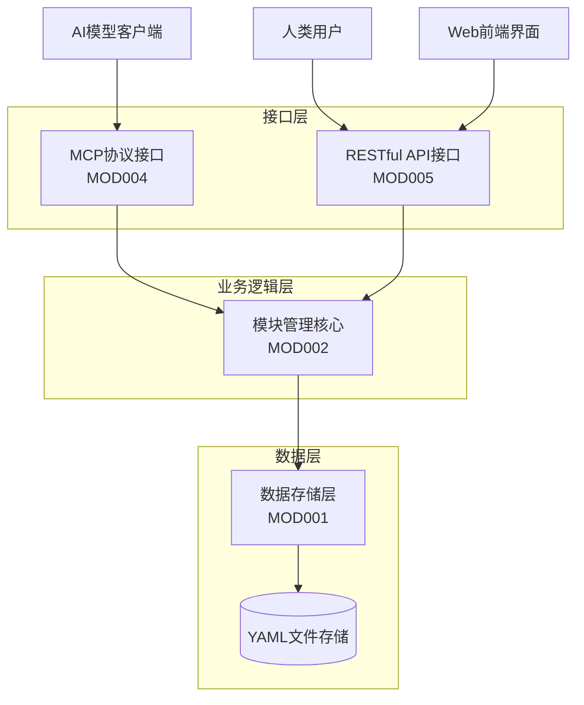
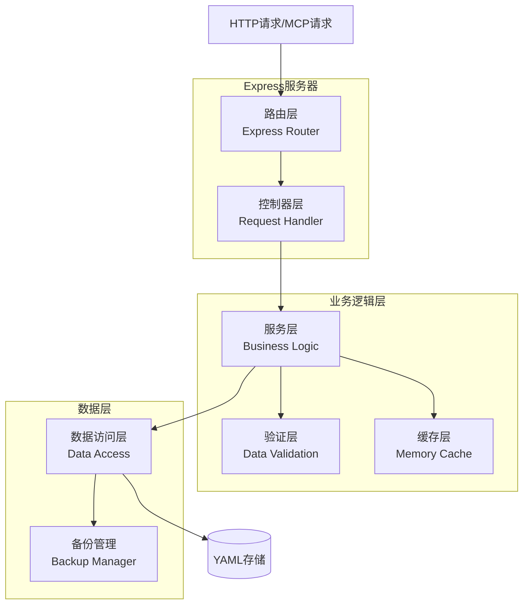
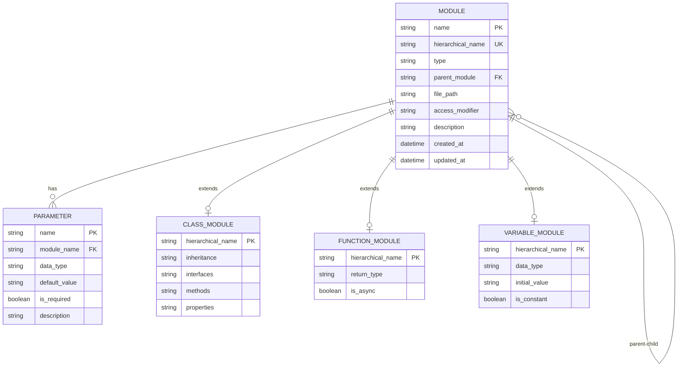

# 代码文档管理工具 - 技术架构文档

## 1. 架构设计



## 2. 技术描述

- 前端：React@18 + TypeScript + Tailwind CSS + Vite
- 后端：Node.js@18 + TypeScript + Express@4
- 数据存储：YAML文件系统
- 协议支持：MCP协议 + RESTful API
- 开发工具：TypeScript@5 + ESLint + Prettier

## 3. 路由定义

### 3.1 MCP协议路由

| 工具名称 | 功能描述 |
|---------|----------|
| add_module | 添加新的代码模块，支持class、function、variable等类型 |
| get_module_by_name | 根据层次化名称获取指定模块信息 |
| smart_search | 智能搜索模块，支持关键词、类型、文件路径等条件 |
| get_type_structure | 获取指定类型的结构信息和层次关系 |

### 3.2 RESTful API路由

| 路由 | 方法 | 功能描述 |
|------|------|----------|
| /api/modules | GET | 获取根模块列表 |
| /api/modules | POST | 添加新模块 |
| /api/modules/search | GET | 搜索模块 |
| /api/modules/{hierarchical_name} | GET | 获取指定模块 |
| /api/modules/{hierarchical_name} | PUT | 更新模块信息 |
| /api/modules/{hierarchical_name} | DELETE | 删除模块 |

## 4. API定义

### 4.1 核心数据类型

**模块基础类型**
```typescript
interface Module {
  name: string;                    // 模块名称
  hierarchical_name: string;       // 层次化名称
  type: 'class' | 'function' | 'variable' | 'file' | 'functionGroup';
  parent_module?: string;          // 父模块层次化名称
  file_path: string;              // 文件路径
  access_modifier: 'public' | 'private' | 'protected';
  description?: string;           // 描述信息
  created_at: string;             // 创建时间
  updated_at: string;             // 更新时间
}
```

**类模块类型**
```typescript
interface ClassModule extends Module {
  type: 'class';
  inheritance?: string[];         // 继承关系
  interfaces?: string[];          // 实现的接口
  methods?: string[];            // 方法列表
  properties?: string[];         // 属性列表
}
```

**函数模块类型**
```typescript
interface FunctionModule extends Module {
  type: 'function';
  parameters: Parameter[];        // 参数列表
  return_type?: string;          // 返回值类型
  is_async: boolean;             // 是否异步函数
}
```

**变量模块类型**
```typescript
interface VariableModule extends Module {
  type: 'variable';
  data_type: string;             // 数据类型
  initial_value?: string;        // 初始值
  is_constant: boolean;          // 是否常量
}
```

### 4.2 MCP协议接口

**添加模块**
```
TOOL: add_module
```

请求参数：
| 参数名 | 类型 | 必需 | 描述 |
|--------|------|------|------|
| name | string | true | 模块名称 |
| type | string | true | 模块类型 |
| parent_module | string | false | 父模块层次化名称 |
| file_path | string | true | 文件路径 |
| access_modifier | string | true | 访问修饰符 |
| description | string | false | 描述信息 |

响应格式：
```json
{
  "success": true,
  "data": {
    "hierarchical_name": "parent.child.module",
    "message": "模块添加成功"
  }
}
```

### 4.3 RESTful API接口

**获取模块列表**
```
GET /api/modules
```

查询参数：
| 参数名 | 类型 | 必需 | 描述 |
|--------|------|------|------|
| type | string | false | 模块类型过滤 |
| parent | string | false | 父模块过滤 |
| limit | number | false | 返回数量限制 |

响应格式：
```json
{
  "success": true,
  "data": {
    "modules": [...],
    "total": 100,
    "page": 1
  }
}
```

## 5. 服务器架构图



## 6. 数据模型

### 6.1 数据模型定义



### 6.2 数据定义语言

**YAML存储结构**
```yaml
# modules.yaml
modules:
  - name: "MyClass"
    hierarchical_name: "project.core.MyClass"
    type: "class"
    parent_module: "project.core"
    file_path: "/src/core/MyClass.ts"
    access_modifier: "public"
    description: "核心业务类"
    created_at: "2024-01-01T00:00:00Z"
    updated_at: "2024-01-01T00:00:00Z"
    # 类特有属性
    inheritance: ["BaseClass"]
    interfaces: ["IMyInterface"]
    methods: ["project.core.MyClass.method1"]
    properties: ["project.core.MyClass.prop1"]
    
  - name: "method1"
    hierarchical_name: "project.core.MyClass.method1"
    type: "function"
    parent_module: "project.core.MyClass"
    file_path: "/src/core/MyClass.ts"
    access_modifier: "public"
    description: "核心方法"
    created_at: "2024-01-01T00:00:00Z"
    updated_at: "2024-01-01T00:00:00Z"
    # 函数特有属性
    parameters:
      - name: "param1"
        data_type: "string"
        default_value: null
        is_required: true
        description: "参数1"
    return_type: "boolean"
    is_async: false

# 配置文件 config.yaml
config:
  storage:
    root_path: "./data"
    backup_enabled: true
    backup_interval: 3600
    max_backups: 10
  validation:
    max_nesting_level: 5
    max_name_length: 100
    allowed_types: ["class", "function", "variable", "file", "functionGroup"]
  cache:
    enabled: true
    ttl: 300
    max_size: 1000
```

**初始化数据**
```yaml
# 示例数据
modules:
  - name: "root"
    hierarchical_name: "root"
    type: "file"
    parent_module: null
    file_path: "/"
    access_modifier: "public"
    description: "根模块"
    created_at: "2024-01-01T00:00:00Z"
    updated_at: "2024-01-01T00:00:00Z"
```